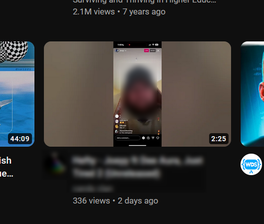
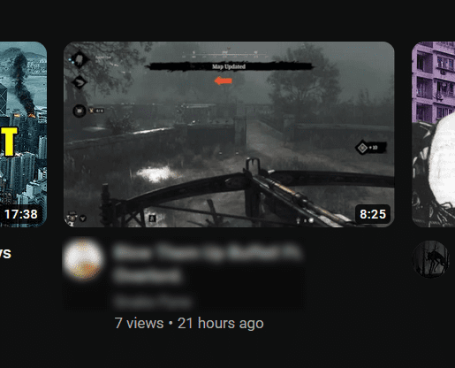

# Youtube: remove unpopular videos

This Tampermonkey script is designed to declutter your YouTube recommendations by removing videos with fewer than a certain number of views. It operates by scanning the videos in your YouTube recommendations and removing any that fall below the specified view count threshold.

## How does it work?

The script works by scanning the videos in your YouTube recommendations and removing any that have fewer than a specified number of views. The default threshold is set at 1000 views, but this can be easily adjusted to suit your preferences.

<p float="left">
  
  
</p>
## Installation 

1. Install tampermonkey extension:

<a href="https://chrome.google.com/webstore/detail/tampermonkey/dhdgffkkebhmkfjojejmpbldmpobfkfo?hl=en">Chromium</a>

<a href="https://addons.mozilla.org/ru/firefox/addon/tampermonkey/">Firefox</a>

2. Install this script:

<a href="https://greasyfork.org/en/scripts/478273-youtube-remove-unpopular-videos?locale_override=1">Greasy fork</a>

That's it! Now you can use it.

## Customizing the View Count Threshold

To adjust the view count threshold, you need to modify the value of `minViews` in the script. For instance, if you want to remove videos with less than 5000 views, you would change:

```javascript
var minViews = 1000; // Minimum number of views
```

to:

```javascript
var minViews = 5000; // Minimum number of views
```
"

## FAQ
### Why the script doesn't work?
If the default language of the YouTube page isn't English, the script won't work.
In future versions of this script, I'll add more languages. For now it supports only english.
